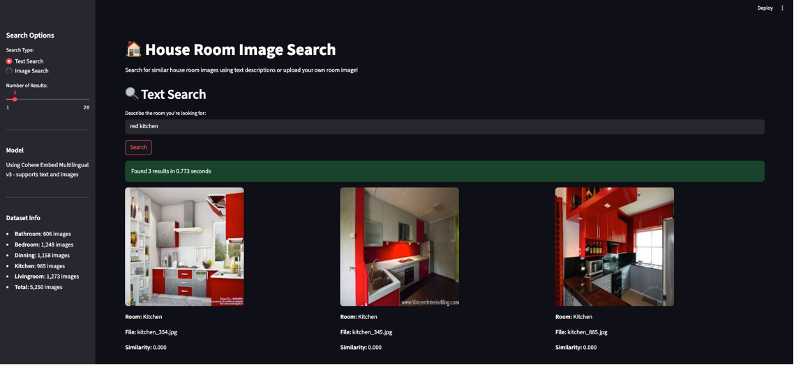

# House Products Vector Search

A Streamlit application for semantic search of house room images using AWS S3 Vectors.

## Features
- Text-based semantic search for room images
- Image similarity search using uploaded images
- AWS S3 Vectors integration for fast vector search
- Interactive web interface with Streamlit
- Support for 5,250+ house room images across 5 categories
- Parallel processing for dataset generation
- Comprehensive cost analysis for multi-environment deployment

## Dataset
The application uses a house rooms dataset with:
- **Bathroom**: 606 images
- **Bedroom**: 1,248 images  
- **Dining**: 1,158 images
- **Kitchen**: 965 images
- **Living room**: 1,273 images
- **Total**: 5,250 images

## Technology Stack
- **Frontend**: Streamlit
- **Vector Search**: AWS S3 Vectors
- **Embeddings**: Cohere Embed Multilingual v3 (via Amazon Bedrock)
- **Image Processing**: PIL (Pillow)
- **AWS Services**: Bedrock, S3 Vectors
- **Parallel Processing**: ThreadPoolExecutor for efficient dataset generation

## Setup

### Prerequisites
- AWS account with access to Bedrock and S3 Vectors
- Python 3.8+
- AWS credentials configured
- House rooms dataset (automatically downloaded via kagglehub)

### Installation
1. Clone the repository:
   ```bash
   git clone https://github.com/pedrobenito/sample-s3-vectors-house-products.git
   cd sample-s3-vectors-house-products
   ```

2. Install dependencies:
   ```bash
   pip install -r requirements.txt
   ```

3. Configure environment variables:
   ```bash
   # Create .env file with your configuration
   S3_VECTOR_BUCKET_NAME=house-rooms-bucket
   S3_VECTOR_INDEX_NAME=house-rooms-index
   MAX_WORKERS=50
   ```

### Data Setup

4. Generate the dataset with embeddings:
   ```bash
   python generate_house_dataset_parallel.py
   ```

5. Ingest vectors into S3 Vectors:
   ```bash
   python ingest_house_vectors.py
   ```

6. Run the application:
   ```bash
   streamlit run streamlit_house_app.py
   ```



## Usage

### Text Search
1. Select "Text Search" in the sidebar
2. Enter a description of the room you're looking for (e.g., "modern kitchen", "cozy bedroom")
3. Adjust the number of results using the slider
4. Click "Search" to find similar rooms

### Image Search
1. Select "Image Search" in the sidebar
2. Upload an image of a room (PNG, JPG, JPEG)
3. Adjust the number of results using the slider
4. Click "Search" to find visually similar rooms

## Architecture
The application uses:
- **Cohere Embed Multilingual v3** for generating embeddings from text and images
- **AWS S3 Vectors** for storing and querying vector embeddings
- **Streamlit** for the web interface
- **Amazon Bedrock** for accessing the embedding model

## Files

### Core Application
- `streamlit_house_app.py` - Main Streamlit application
- `utils.py` - Utility functions for embeddings and search
- `requirements.txt` - Python dependencies

### Data Processing
- `generate_house_dataset_parallel.py` - Generate dataset with embeddings using parallel processing
- `ingest_house_vectors.py` - Ingest images and create S3 vector index

### Documentation
- `house_image_search_multi_env_cost_analysis.md` - Comprehensive cost analysis for multi-environment deployment (DEV/INT/PROD)

## Cost Analysis

The repository includes a detailed cost analysis (`house_image_search_multi_env_cost_analysis.md`) covering:
- Multi-environment deployment costs (DEV, INT, PROD)
- Service-by-service cost breakdown
- Optimization recommendations
- Total monthly cost: **$981.40** across all environments

Key cost drivers:
- ECS Fargate compute: 78.7% of total cost
- Load balancing: 5.5%
- AI/ML services: 4.3%
- Storage: 2.8%

## Performance
- Parallel processing with configurable worker threads
- Batch vector ingestion for efficiency
- Cosine similarity search with 1024-dimensional embeddings
- Sub-second search response times

## Environment Variables
- `S3_VECTOR_BUCKET_NAME`: S3 Vectors bucket name
- `S3_VECTOR_INDEX_NAME`: Vector index name
- `MAX_WORKERS`: Number of parallel workers for dataset generation

## License
This project is open source and available under the MIT License.